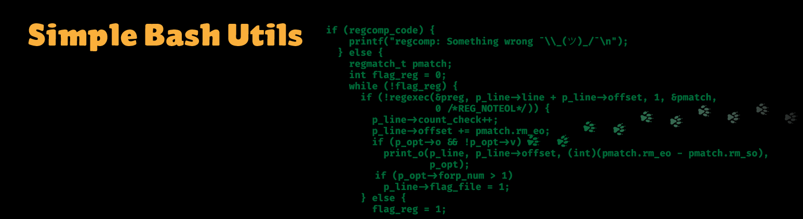

> Hello everybody out there using minix -
>
>I'm doing a (free) operating system (just a hobby, won't be big and professional like gnu) for 386(486) AT clones. This has been brewing since april, and is starting to get ready. I'd like any feedback on things people like/dislike in minix, as my OS resembles it somewhat (same physical layout of the file-system (due to practical reasons) among other things).
>
>I've currently ported bash(1.08) and gcc(1.40), and things seem to work. This implies that I'll get something practical within a few months, and I'd like to know what features most people would want. Any suggestions are welcome, but I won't promise I'll implement them :-)
>
>Linus (torvalds@kruuna.helsinki.fi)
>
>PS. Yes - it's free of any minix code, and it has a multi-threaded fs. It is NOT portable (uses 386 task switching etc), and it probably never will support anything other than AT-harddisks, as that's all I have :-(.
>
>— Linus Torvalds

## Cat

### cat Usage

`cat [OPTION] [FILE]...`

### cat Options

| No. | Options | Description |
| ------ | ------ | ------ |
| 1 | -b (GNU: --number-nonblank) | numbers only non-empty lines |
| 2 | -e implies -v (GNU only: -E the same, but without implying -v) | but also display end-of-line characters as $  |
| 3 | -n (GNU: --number) | number all output lines |
| 4 | -s (GNU: --squeeze-blank) | squeeze multiple adjacent blank lines |
| 5 | -t implies -v (GNU: -T the same, but without implying -v) | but also display tabs as ^I  |

## Grep

### grep Usage

`grep [options] template [file_name]`

### grep Options

| No. | Options | Description |
| ------ | ------ | ------ |
| 1 | -e | pattern |
| 2 | -i | Ignore uppercase vs. lowercase.  |
| 3 | -v | Invert match. |
| 4 | -c | Output count of matching lines only. |
| 5 | -l | Output matching files only.  |
| 6 | -n | Precede each matching line with a line number. |
| 7 | -h | Output matching lines without preceding them by file names. |
| 8 | -s | Suppress error messages about nonexistent or unreadable files. |
| 9 | -f file | Take regexes from a file. |
| 10 | -o | Output the matched parts of a matching line. |